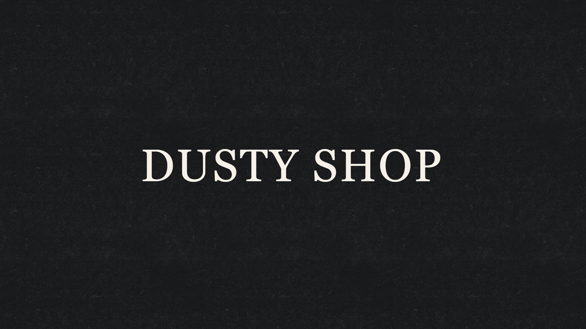
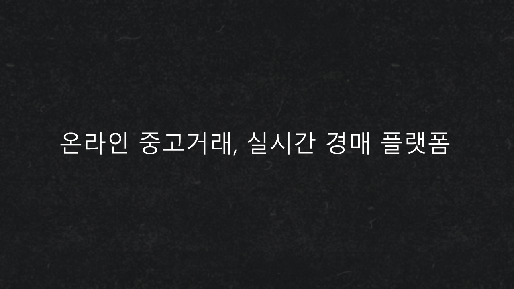
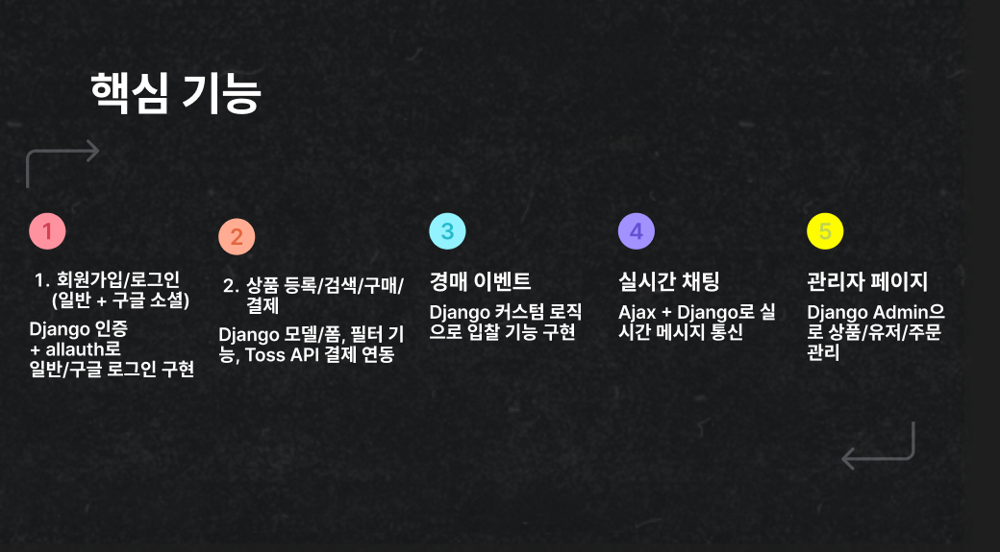
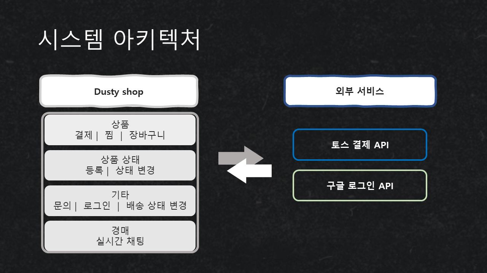
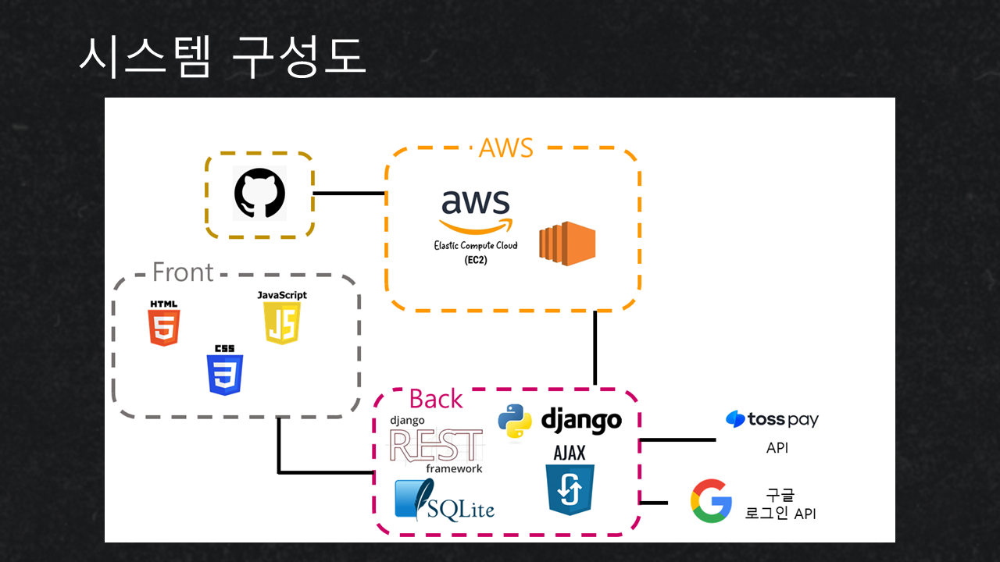

# DUSTY SHOP

## 팀 멤버 소개

| **김윤석** | **김윤정** | **김형준** | **송윤석** |
| :------: | :------: | :------: | :------: |
|[ @Monzi](https://github.com/Dusty-Miller)|[ @beautiyj](https://github.com/beautiyj)|[ @KimHyeongjun](https://github.com/Ayewww)|[ @SongYunSeok0](https://github.com/SongYunSeok0/SongYunSeok0.github.io)|

## 개발 환경

Front-end:
    
Back-end:
    
Database:
   
서버 구성:
  
협업 툴:
  
디자인:
   

## 프로젝트 개요

## 시연 영상

[YouTube 영상](https://youtu.be/EqJkZOaBZCw)
